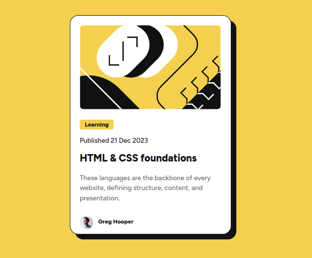

# Frontend Mentor - Blog preview card solution

This is a solution to the [Blog preview card challenge on Frontend Mentor](https://www.frontendmentor.io/challenges/blog-preview-card-ckPaj01IcS). Frontend Mentor challenges help you improve your coding skills by building realistic projects. 

## Table of contents

- [Overview](#overview)
  - [The challenge](#the-challenge)
  - [Screenshot](#screenshot)
  - [Links](#links)
- [My process](#my-process)
  - [Built with](#built-with)
  - [What I learned](#what-i-learned)
  - [Continued development](#continued-development)
- [Author](#author)

## Overview

### The challenge

Users should be able to:

- See hover and focus states for all interactive elements on the page

### Screenshot

### Links

- Solution URL: [Add solution URL here](https://your-solution-url.com)
- Live Site URL: [Add live site URL here](https://your-live-site-url.com)

## My process

### Built with

- Semantic HTML5 markup
- CSS custom properties
- Flexbox

### What I learned

Sigo aprendendo a importância de estruturar o código de CSS de acordo com a ordem HTML, essa organização auxilia a localização de informações e acelera o processo de escrita e correção. 

### Continued development

Não faz muito que comecei a estudar CSS, e ainda me atrapalho um pouco com os conceitos de Flexbox, então preciso me dedicar ao domínio da técnica.

## Author

- Frontend Mentor - [@eros77sc](https://www.frontendmentor.io/profile/eros77sc)

